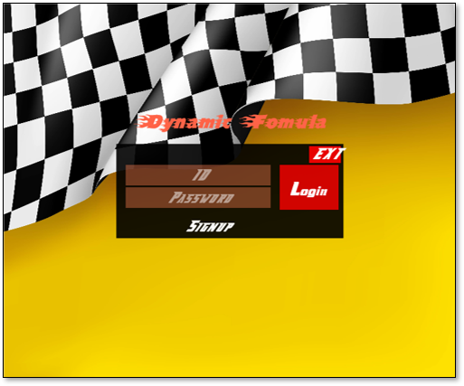
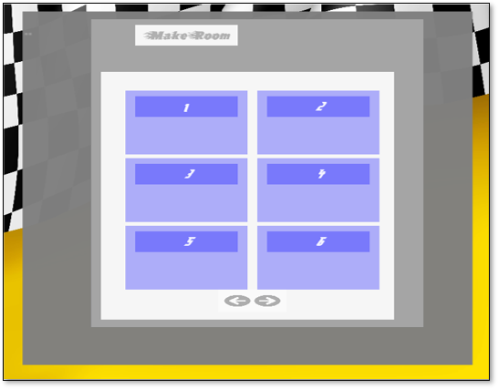
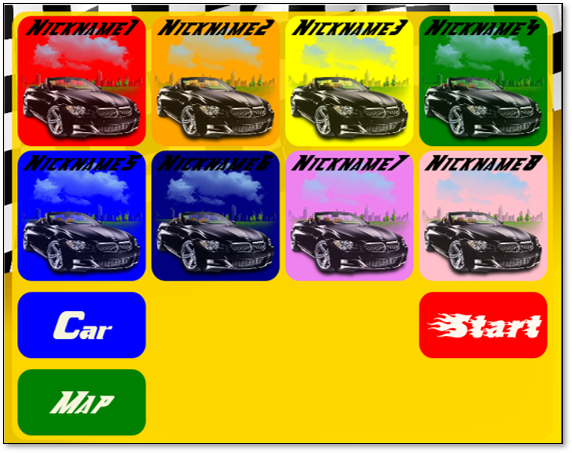
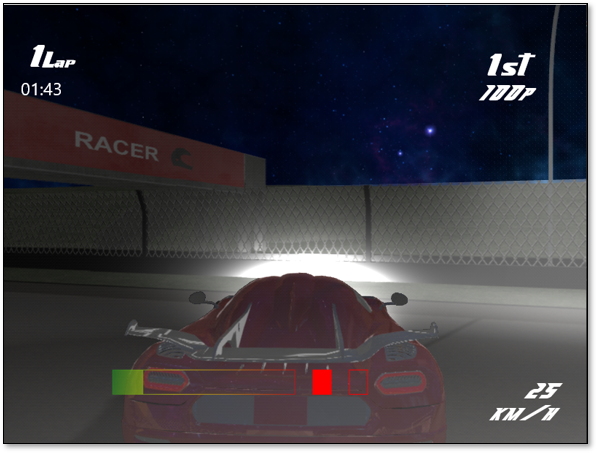

# Dynamic-Formula
>졸업작품 다이나믹 포뮬러

## 팀 구성
- 클라이언트 2명
- 서버 1명

## 게임흐름
### 로그인

 - 유저 등록 및 로그인
### 로비

  - 방 생성 및 참여
### 방

  - 맵 선택
  - 준비 및 시작
### 인 게임

  - 게임 플레이

## 기술 스택
### 클라이언트
- Direct3D12
  - 렌더링 및 그래픽스 기술 구현
- Direct2D
  - UI 렌더링
- FMOD
  - 사운드 관리
  
### 서버
- IOCP, WinSock
  - 비동기 서버 제작
  - 패킷 전송 및 수신
- Bullet Physics
  - 물리엔진 시뮬레이션